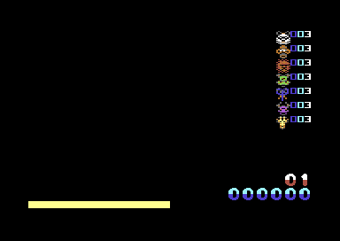

```
 ________   ___    __  __    _    _   _ ___    _    
|__  / _ \ / _ \  |  \/  |  / \  | \ | |_ _|  / \   
  / / | | | | | | | |\/| | / _ \ |  \| || |  / _ \  
 / /| |_| | |_| | | |  | |/ ___ \| |\  || | / ___ \ 
/____\___/ \___/  |_|  |_/_/   \_\_| \_|___/_/   \_\
                                                    
ZOO MANIA
```




After having left the C64 some years ago I recently came back to see if this old project would still compile and decided to put this here on codeberg.


# Zoo Mania

After having left the C64 some years ago I recently came back to see
if this old project would still compile and decided to put this here
on github.


## What is it?

Zoo Mania is a puzzle game for the Commodore C64 which has been
initiated around 2005 in [Forum-64](http://www.forum-64.de) by some
folks and has been implemented in collaboration. I had the pleasure to
do the coding and finally I managed to get the sources back together
and here they are.


## Compile

Zoo Mania is a C/ASM hybrid and can be build with the
[CC65](http://cc65.github.io) compiler suite. There is a very
rudimentary Makefile, so you can just type `make` to build the game.


## Credits

- Code: hannenz

- Ingame graphics: Crossbow

- Title picture by Scorpi.us

- Music: Fanta

- Contributions, Bugfixes etc: Groepaz, others


## Mentions

- https://csdb.dk/release/?id=33799

- https://www.c64-wiki.com/wiki/Zoo_Mania

- https://gamesdb.launchbox-app.com/games/images/138969-zoo-mania

- https://www.gamestar.de/galerien/die_besten_neuen_c64_spiele,133739.html

- https://www.youtube.com/watch?v=1LsD0_Hnz3Y


## Data: File and Memory Layout

zootitle.pic

| File            | Memory | Description   |
| ---             | ---    | ---           |
| 0x0000 - 0x1540 | 0xE000 | Bitmap        |
| 0x1540 - 0x17E8 | 0xCC00 | Screen-RAM    |
| 0x17E8 - 0x1a90 | 0xD800 | Color-RAM     |
| 0x1A91          | 0xD021 | VIC_BG_COLOR0 |


zoo.dat

| File            | Memory | Description                     |
| ---             | ---    | ---                             |
| 0x0000 - 0x0001 | -      | Load Address                    |
| 0x0002 - 0x0241 | 0x0DC0 | 9 Sprites: 8 Animals + 1 Cursor |
| 0x0242 - 0x1ADF | 0x1000 | Music                           |
| 0x1Ae0 - 0x1E41 | 0x289E | Padded with zeroes              |
| 0x1E42 - 0x3241 | 0x2C00 | Charset                         |

